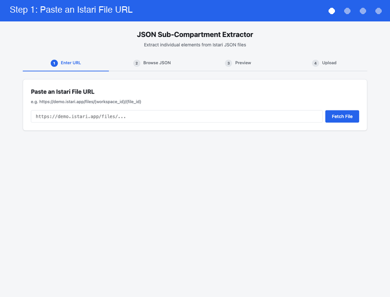
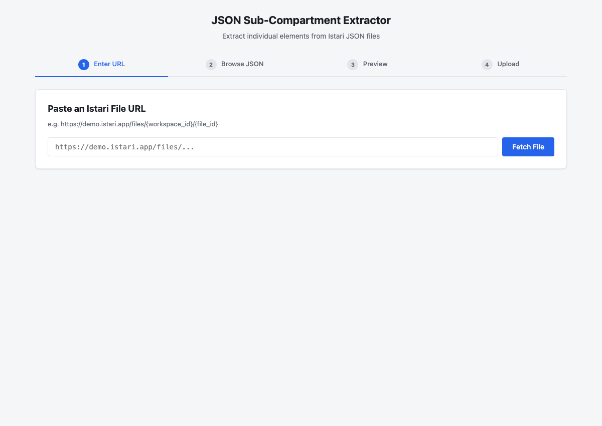
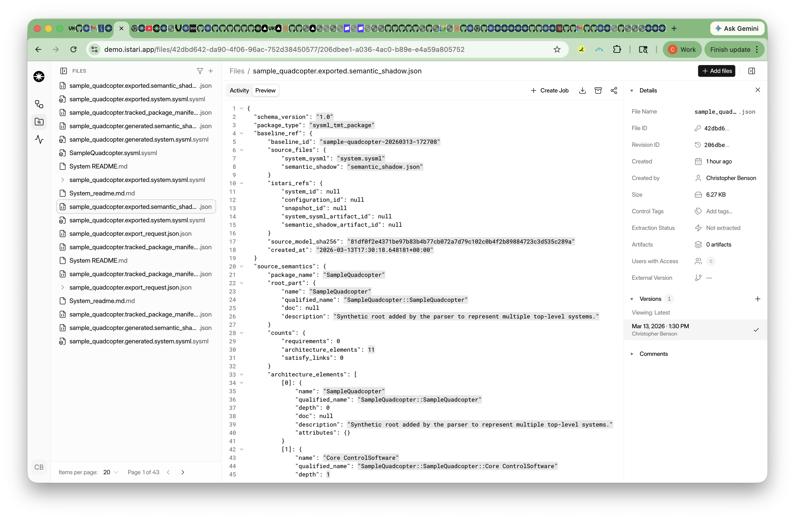
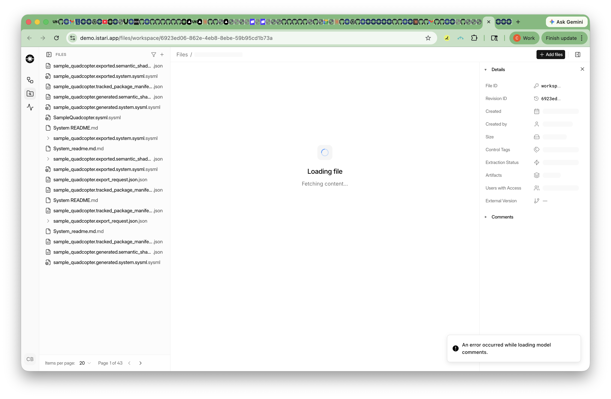
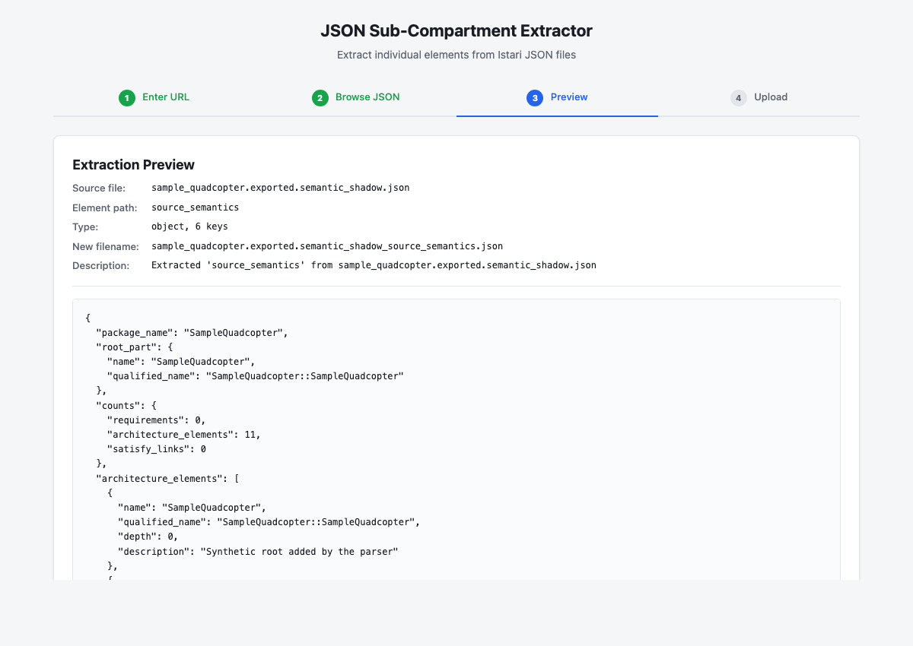
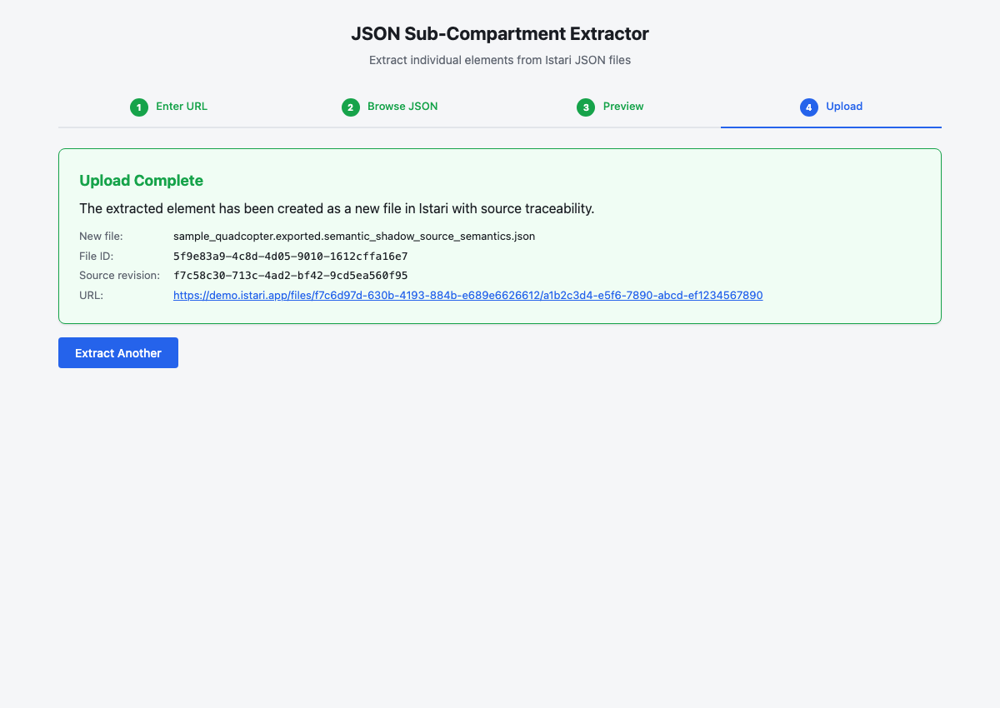

# JSON Sub-Compartment Extractor: User Walkthrough

Extract individual elements from Istari JSON files and upload them as new artifacts with full source traceability.



---

## Prerequisites

1. **Python 3.10+** (the Istari SDK requires it)
2. **Istari Personal Access Token** (generate at Settings > Developer Settings in Istari)

## Setup

```bash
# Clone and enter the project
cd sub_compartment_JSON

# Create a virtual environment with Python 3.10+
python3 -m venv .venv
source .venv/bin/activate

# Install dependencies
pip install -r requirements.txt

# Configure credentials
cp .env.example .env
# Edit .env:
#   ISTARI_DIGITAL_REGISTRY_URL=https://fileservice-v2.demo.istari.app
#   ISTARI_DIGITAL_REGISTRY_AUTH_TOKEN=<your-token>
```

## Launch

```bash
source .venv/bin/activate
python -m src.web
```

Open **http://localhost:5001** in your browser.

---

## Step 1: Enter an Istari File URL

Navigate to a JSON file in the Istari web app and copy the URL from your browser's address bar.



The URL follows the format:
```
https://demo.istari.app/files/{model_id}/{revision_id}
```

For example, here's a `sample_quadcopter.exported.semantic_shadow.json` file in Istari:



Paste the URL and click **Fetch File**. The tool will:
1. Parse the model ID and revision ID from the URL
2. Connect to Istari via the SDK
3. Download the JSON content
4. Display the file metadata (name, size, revision count)

---

## Step 2: Browse the JSON Tree

Once fetched, you'll see an interactive JSON tree on the left and a preview panel on the right.



### Navigating the tree

- **Click the arrow** (&#9654;) next to any object or array to expand/collapse it
- Use **Expand All** / **Collapse All** buttons for quick navigation
- Each node shows a **colored type badge**:
  - `object(N)` - orange badge, N keys
  - `array(N)` - green badge, N items
  - `string` - blue badge
  - `number` - purple badge
  - `boolean` - yellow badge
  - `null` - gray badge

### Selecting an element

Click any node in the tree to select it. The right panel will show:
- The **path** to the selected element (e.g., `source_semantics.architecture_elements`)
- The **type** description (e.g., `array, 11 items`)
- A **preview** of the content

For example, selecting `source_semantics` from a `sample_quadcopter` semantic shadow file shows:

```json
{
  "package_name": "SampleQuadcopter",
  "root_part": { ... },
  "counts": {
    "requirements": 0,
    "architecture_elements": 11,
    "satisfy_links": 0
  },
  "architecture_elements": [
    {
      "name": "SampleQuadcopter",
      "qualified_name": "SampleQuadcopter::SampleQuadcopter",
      "depth": 0,
      "description": "Synthetic root added by the parser..."
    },
    ...
  ],
  "requirements": [],
  "satisfy_links": []
}
```

Once you've found the element you want, click **Extract This Element**.

---

## Step 3: Preview the Extraction

Before uploading, you'll see a full preview of what will be created:



| Field | Example |
|-------|---------|
| **Source file** | `sample_quadcopter.exported.semantic_shadow.json` |
| **Element path** | `source_semantics` |
| **Type** | `object, 6 keys` |
| **New filename** | `sample_quadcopter.exported.semantic_shadow_source_semantics.json` |
| **Description** | `Extracted 'source_semantics' from sample_quadcopter.exported.semantic_shadow.json` |

The full JSON content is shown below so you can verify it's exactly what you want.

- Click **Upload to Istari** to proceed
- Click **Back** to return to the tree and select a different element

---

## Step 4: Upload Complete

After uploading, you'll see a confirmation with:



- **New file name** and **File ID**
- **Source revision** linking back to the original file (traceability)
- A **clickable URL** that opens the new file directly in Istari

The extracted element is created as an **artifact** under the same model as the source file, so it appears alongside the original in your Istari workspace.

Click **Extract Another** to start over with a new file or element.

---

## How It Works Under the Hood

```
Istari URL ──> Parse model_id + revision_id
                         │
                         ▼
              Istari SDK: get_model() ──> find file by revision
                         │
                         ▼
              file.read_json() ──> full JSON in memory
                         │
                         ▼
              User selects path ──> resolve_path(data, "source_semantics")
                         │
                         ▼
              Extract element ──> write to temp file
                         │
                         ▼
              client.add_artifact(model_id, path, sources=[NewSource(...)])
                         │
                         ▼
              New artifact in Istari with source traceability
```

### Source Traceability

Every extracted file includes a `NewSource` link back to the exact revision of the original file:

```python
NewSource(
    revision_id="206dbee1-a036-4ac0-b89e-e4a59a805752",  # original revision
    relationship_identifier="extracted_from"
)
```

This creates a visible provenance chain in Istari, so you can always trace an extracted element back to its source.

---

## Real-World Use Cases

### 1. Extract architecture elements from a semantic shadow

A `semantic_shadow.json` contains architecture, requirements, and traceability data bundled together. Extract just the `source_semantics.architecture_elements` array to share the architecture with a team that doesn't need the full package.

### 2. Pull out TMT verification status

Extract `tmt_status` from a package to get a standalone snapshot of the verification campaign status, including milestone counts, equipment lists, and evidence summaries.

### 3. Isolate baseline references

Extract `baseline_ref` to capture the exact source file hashes and Istari references for a specific baseline, useful for audit trails and configuration management.

---

## Troubleshooting

| Issue | Solution |
|-------|----------|
| `ISTARI_DIGITAL_REGISTRY_URL not set` | Create a `.env` file from `.env.example` and fill in your credentials |
| `No module named 'istari_digital_client'` | Make sure you're using Python 3.10+ and have run `pip install -r requirements.txt` |
| `404: File ID Not Found` | The URL might use a different ID format. Copy the URL directly from your Istari browser address bar |
| `localhost:5001 refused to connect` | Make sure the server is running: `python -m src.web` |
| Empty tree on Step 2 | Hard-refresh with Cmd+Shift+R (Mac) or Ctrl+Shift+R (Windows) |

---

## CLI Alternative

If you prefer a terminal interface, the tool also has a CLI mode:

```bash
source .venv/bin/activate
python -m src
```

This provides the same functionality with an interactive text-based flow.
